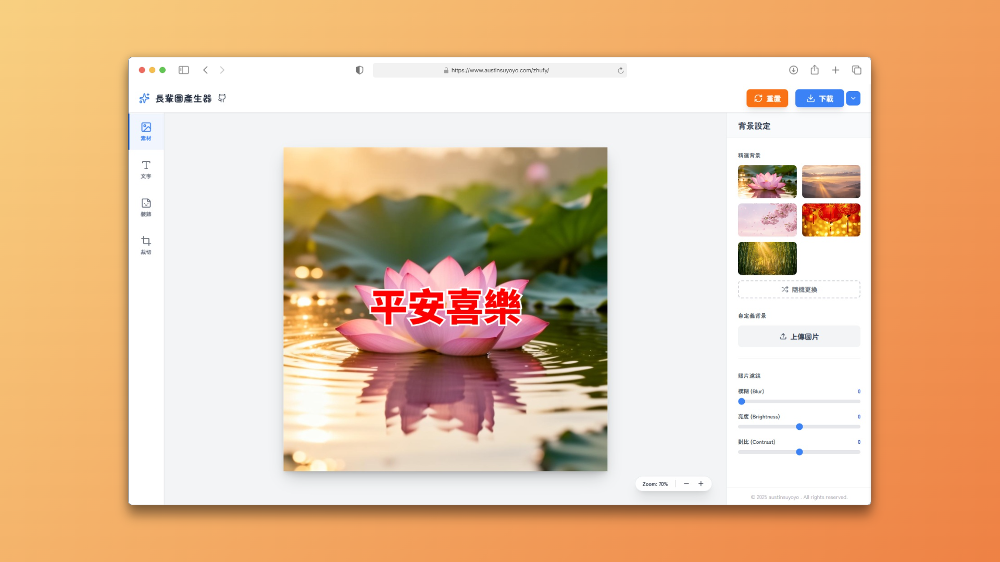

# Zhufy - Greeting Card Generator

**[English](./README.en.md)** | **[中文](./README.md)**

A modern, high-performance greeting card editor built with Vue 3, TypeScript, and Fabric.js. Create beautiful greeting cards with backgrounds, text, filters, emojis, and more.



## ✨ Features

- **Background Management** - Preset backgrounds and custom image upload
- **Photo Filters** - Blur, brightness, and contrast adjustments
- **Text Editing** - Font, size, color, stroke, and direction control
- **Text Templates** - Pre-configured text styles (title, subtitle, decorative)
- **Emoji Decorations** - Rich emoji library for card decoration
- **Custom Stickers** - Upload and add custom stickers
- **Image Cropping** - Precise crop with boundary constraints
- **Layer Management** - Object layering and selection
- **Canvas Zoom** - Zoom in/out with mouse wheel (Ctrl + scroll)
- **Keyboard Shortcuts** - Delete objects, duplicate (Ctrl+D)

## 🛠️ Tech Stack

- Vue 3
- TypeScript
- Fabric.js
- Tailwind CSS

## 🚀 Getting Started

### Prerequisites

- Node.js `^20.19.0 || >=22.12.0`
- npm or yarn

### Installation

```bash
# Install dependencies
npm install

# Start development server
npm run dev

# Build for production
npm run build

# Preview production build
npm run preview
```

## 📁 Project Structure

```
zhufy/
├── src/
│   ├── components/        # Vue components
│   │   └── panels/        # Panel components (Background, Text, Decor, Crop)
│   ├── composables/       # Composition API hooks
│   ├── config/            # Configuration files
│   ├── router/            # Vue Router configuration
│   ├── stores/            # Pinia stores
│   ├── utils/             # Utility functions
│   ├── views/             # Page views
│   └── style.css          # Global styles
├── e2e/                   # Playwright E2E tests
│   ├── features/          # Feature tests
│   ├── fixtures/          # Test fixtures
│   ├── interaction/       # Interaction tests
│   ├── layout/            # Layout tests
│   ├── pages/             # Page object models
│   ├── regression/        # Regression tests
│   ├── smoke/             # Smoke tests
│   └── utils/             # Test utilities
└── public/                # Static assets
```

## 📝 Development

### Available Scripts

```bash
npm run dev          # Start development server
npm run build        # Build for production (with type checking)
npm run preview      # Preview production build
npm run lint         # ESLint check and fix
npm run format       # Prettier format code
npm run type-check   # TypeScript type checking
```

### E2E Testing

```bash
npm run test:e2e         # Run all E2E tests
npm run test:e2e:ui      # Run tests in UI mode
npm run test:e2e:headed  # Run tests in headed mode
npm run test:e2e:debug   # Run tests in debug mode
```
